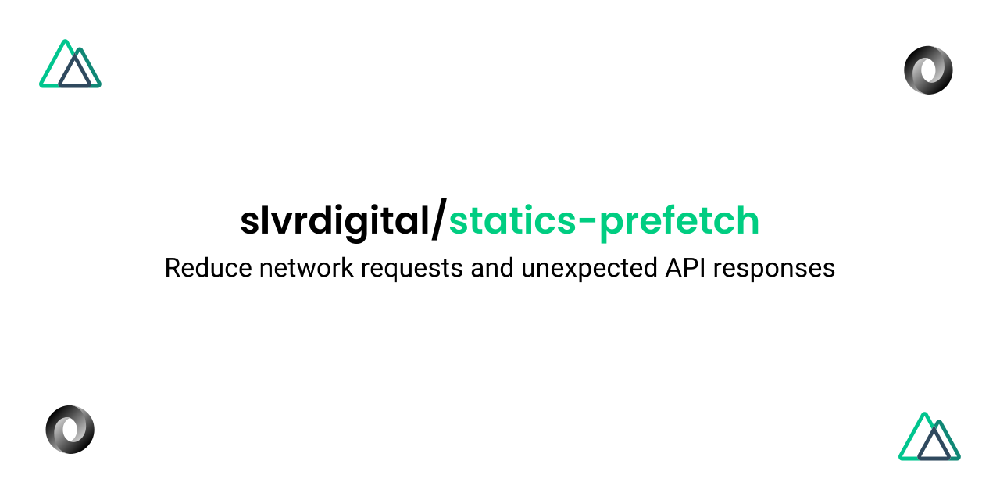

[](https://github.com/slvrdigital/statics-prefetch-module)
# @slvrdigital/statics-prefetch

- [✨ &nbsp;Release Notes](http://example.com/releases)
- [📖 &nbsp;Documentation](https://example.com)

## Features

- Prefetch static data
- Format response data

[📖 &nbsp;Read more](http://example.com)

## Quick Setup

1. Add `@slvrdigital/statics-prefetch` dependency to your project

```bash
npm install @slvrdigital/statics-prefetch # or yarn add @slvrdigital/statics-prefetch
```

2. Add `@slvrdigital/statics-prefetch` to the `buildModules` section of `nuxt.config.js` (or `modules` if on Nuxt < 2.9>)

```js
{
  buildModules: [
    '@slvrdigital/statics-prefetch',
  ],
}
```

## Add Options

Add services config and more using the module options.

```js
staticsPrefetch: {
  stopOnFail: false,
  serviceCollection: [
    {
      url: 'https://jsonplaceholder.typicode.com/posts',
      saveAs: 'posts.json'
    }
  ]
}
```

See [module options](http://example.com/options).

## Usage

Run the `dev` or `build` command and you will see pre-fetched data in the Nuxt CLI which you can then import and use in app.

Simple use example:

```bash
npm run dev # or npm run build
or
yarn dev # or yarn build
```

See [Usage](https://example.com/usage).

## Development

1. Clone this repository
2. Install dependencies using `npm install` or `yarn add`
3. Start development server using `npm run dev` or `yarn dev`

## License

[MIT License](./LICENSE)
